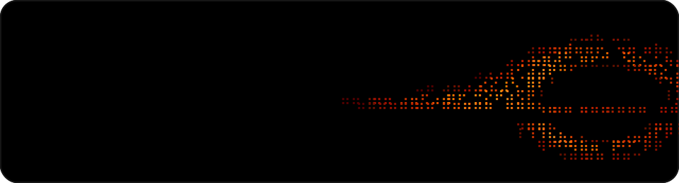

# blak.nvim

<p align="center">
  
</p>

**Blak** is a native-first Neovim distribution built around a black-hole aesthetic and a strict product contract:

> Everything useful. Nothing escapes.

It is designed to be installable in one command, useful out of the box, easy to understand, and safe to extend through reversible extras.

The longer promise lives in [MANIFESTO.md](MANIFESTO.md):

> We use native Neovim first.
> We ship only what earns its gravity.
> We do not hide configuration behind magic.
> We do not break your muscle memory on update.
> We make extras easy, reversible, and documented.

## Status

Blak is launching as a **v0.1 public preview**: complete enough to install, use, and share, while still young enough that issues and contributor feedback are expected.

## Requirements

- Neovim 0.12+
- Git
- `rg` for search
- `fd` for faster file discovery
- `tree-sitter` CLI for nvim-treesitter parser installation; Blak can install `tree-sitter-cli` through Mason on first launch, then `:BlakTreesitterInstall` can install parsers.
- A Nerd Font is recommended, not required

## Install

```sh
curl -fsSL https://getblak.dev/install.sh | sh
blak
```

The installer clones Blak to `~/.config/blak`, creates a small `~/.local/bin/blak` launcher, and uses `NVIM_APPNAME=blak`, so it does not overwrite an existing Neovim config.

For development from this checkout:

```sh
git clone https://github.com/binbandit/blak.nvim ~/.config/blak
NVIM_APPNAME=blak nvim
```

## Default Kit

Blak's defaults are intentionally small. They cover the editing floor and leave preference-heavy features as extras.

- Package backend: `lazy.nvim`, committed lockfile, rollback snapshots
- Picker: `fff.nvim` for files and grep, with Snacks fallback for broader picker actions
- UI: Snacks dashboard/input/notifier/picker/quickfile/bigfile/words, plus the animated black-hole splash
- Completion: `blink.cmp` on the stable `1.*` line
- LSP: native `vim.lsp.config()` with `mason-lspconfig` handling Mason-backed `vim.lsp.enable()`
- Tools: Mason, Conform, nvim-lint, nvim-treesitter
- Editing: Oil file explorer, native terminal split, Gitsigns, which-key, `mini.icons`
- Theme: TokyoNight Night (`tokyonight-night`)

## Core commands

```vim
:Blak              overview
:BlakDoctor        health checks
:BlakKeys          keymaps registered by Blak
:BlakNews          release notes
:BlakPick files    picker entrypoint
:BlakExtras        list optional extras
:BlakUpdate        update plugins with lockfile backup
:BlakUpgrade       intentional bigger moves
:BlakRollback      restore last lockfile backup and run Lazy restore
:BlakToolsInstall  install Mason tools required by enabled extras
:BlakTreesitterInstall install configured Treesitter parsers
:BlakTerminal [cmd] toggle a native terminal split
:BlakFormat        format current buffer
:BlakFormatToggle  toggle format-on-save
:BlakSplash        preview the black-hole animation
```

## Extras

Extras are opt-in and reversible:

```vim
:BlakExtras list
:BlakExtras enable lang.typescript
:BlakExtras enable lang.python
:BlakExtras enable git.lazygit
:BlakExtras enable editor.snacks-explorer
:BlakExtras disable lang.python
```

State is stored in `stdpath('state')/blak/extras.json`, not in the repo. Restart Blak after changing extras, then run `:Lazy sync` if the enabled set added or removed plugins.

Default vs. optional is deliberate:

- Language stacks are extras because most users do not need every server, formatter, linter, and parser.
- Alternative pickers and explorers are extras because they replace muscle-memory surfaces.
- LazyGit, Diffview, Copilot, image preview, zen mode, and animations are extras because they are valuable but preference-heavy.

## Customization

Copy the example:

```sh
cp ~/.config/blak/lua/blak/user.example.lua ~/.config/blak/lua/blak/user.lua
```

Then edit `lua/blak/user.lua`:

```lua
return {
  picker = { provider = "fff" },
  extras = {
    enabled = { "lang.typescript", "git.lazygit" },
  },
}
```

## Philosophy

Blak should feel like a polished editor immediately, but never like a mystery box. Defaults live in `lua/blak/config/defaults.lua`, plugin specs live in `lua/blak/plugins/`, provider adapters live in `lua/blak/providers/`, and extras live in `lua/blak/extras/`.

Stable updates must not silently swap major workflow components. `:BlakUpdate` creates rollback points; `:BlakUpgrade` exists for intentional bigger moves.

## Before posting

```sh
make validate
make smoke
```

`make validate` is static and works without Neovim. `make smoke` runs Neovim headless and should be run locally on a machine with Neovim 0.12+. GitHub Actions runs static validation and a Neovim smoke test on every push and pull request.

## Documentation

The full documentation site lives at [getblak.dev](https://getblak.dev/) and is built from `docs/` with [Astro Starlight](https://starlight.astro.build/).

To run it locally:

```sh
cd docs
npm install
npm run dev      # http://localhost:4321/
```

Or via the Makefile from the repo root:

```sh
make docs-install
make docs-dev
make docs-build
```

The site auto-deploys to [getblak.dev](https://getblak.dev/) via GitHub Pages on every push to `main` via `.github/workflows/docs.yml`.
